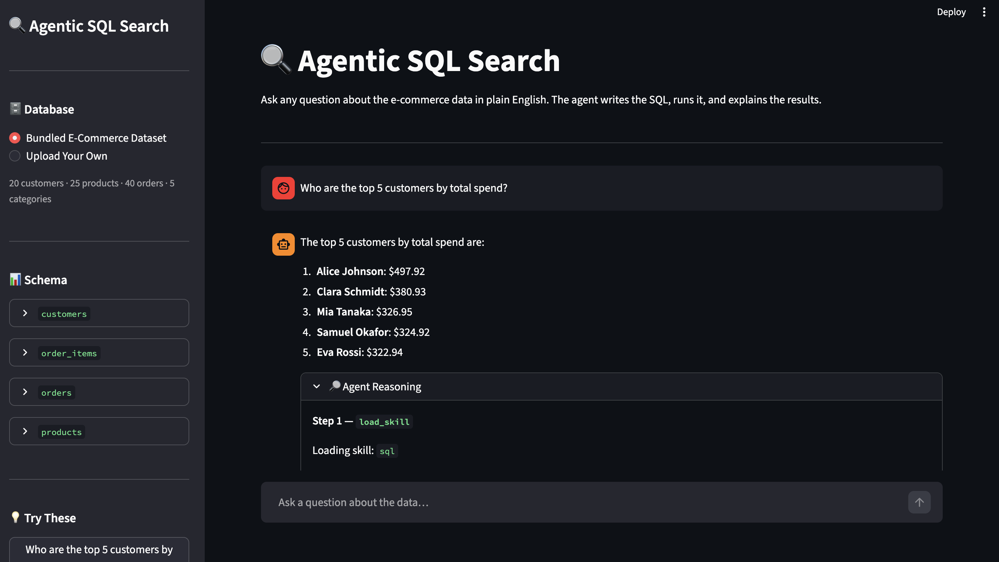

# 🔍 Agentic SQL Search

> Ask a question in plain English and this agent inspects the schema, writes the SQL, runs it, and returns a clear answer.



## Overview

A natural language to SQL agent that lets you query an e-commerce SQLite database in plain English, no SQL knowledge required. 

Instead of hardcoding SQL, the agent follows a deliberate three-step process before answering: it loads a SQL skill document for syntax rules and query patterns, inspects the live database schema to confirm column names, then writes and executes the appropriate query. The Streamlit UI exposes the full reasoning trace so you can see every tool call and its result.

## Features

- **Natural Language Queries:** Ask questions in plain English and the agent figures out the SQL
- **Skill-Based Reasoning:** Agent loads a SQL skill document before writing queries, reducing syntax errors and hallucinations
- **Schema Inspection:** Agent always checks the live schema before querying, never guesses column names
- **Full Reasoning Trace:** Every tool call, query, and result is visible in the UI's Agent Reasoning expander
- **Bundled Dataset:** Ships with a ready-to-use e-commerce SQLite database, no external setup required
- **Bring Your Own Database:** Upload any SQLite `.db` file from the sidebar and the agent will inspect its schema and answer questions against it immediately
- **Sample Questions:** Sidebar includes 8 pre-built questions to get started immediately

## Tech Stack

**Frameworks & Libraries:**
- [LangGraph](https://langchain-ai.github.io/langgraph/): ReAct agent via `create_react_agent`
- [LangChain](https://python.langchain.com/): Tool definitions and LLM integration
- [Streamlit](https://streamlit.io/): Interactive web UI with chat interface

**Models (via Google AI / Gemini API):**
- **LLM:** [`gemma-4-26b-a4b-it`](https://ai.google.dev/gemma/docs/core/gemma_on_gemini_api)

**Database:**
- SQLite (bundled sample dataset, auto-generated on first run)

## Dataset

The bundled e-commerce database includes:

| Table | Description |
|---|---|
| `customers` | 20 customers across 10 countries |
| `products` | 25 products across 5 categories |
| `orders` | 40 orders with statuses: pending, processing, shipped, delivered, cancelled |
| `order_items` | 78 line items linking orders to products |

Categories: Electronics, Clothing, Books, Home & Garden, Sports

## How It Works

```
User Question
      │
      ▼
  load_skill('sql')       ← loads syntax rules + query patterns
      │
      ▼
  get_schema()            ← inspects live table/column structure
      │
      ▼
  execute_sql(query)      ← runs the generated SELECT query
      │
      ▼
  Answer + Reasoning Trace
```

**Tools:**
- **`load_skill`**: reads `skills/sql.md`, which contains SQLite syntax rules, common query patterns, and schema reference
- **`get_schema`**: queries `sqlite_master` and `PRAGMA table_info` to return the live database structure
- **`execute_sql`**: runs any SELECT query and returns a formatted table (SELECT-only for safety)

## Prerequisites

- Python 3.12 or higher
- [uv](https://docs.astral.sh/uv/)
- A Google AI Studio API key

## Installation

### 1. Clone the Repository

```bash
git clone https://github.com/guptasakshi06/-Agentic-SQL-Search

```

### 2. Set Up Environment Variables

```bash
cp .env.example .env
```

Open `.env` and add your key:

```env
GEMINI_API_KEY=your_google_ai_studio_key_here
```

Get your API key at [Google AI Studio](https://aistudio.google.com/app/apikey).

### 3. Install Dependencies

```bash
uv sync
```

## Usage

```bash
uv run streamlit run app.py
```

Navigate to `http://localhost:8501` in your browser.

The bundled e-commerce SQLite database is created automatically on first run. No extra setup needed.

To query your own database, select **Upload Your Own** in the sidebar and upload any `.db`, `.sqlite`, or `.sqlite3` file. The agent will inspect the schema automatically and you can start asking questions right away.

**Example questions to try (bundled dataset):**
- "Who are the top 5 customers by total spend?"
- "Which product category generates the most revenue?"
- "What is the average order value per country?"
- "Which customers placed more than 2 orders?"

## Project Structure

```text
agentic_sql_search/
├── app.py              # Streamlit UI and chat interface
├── agent.py            # LangGraph ReAct agent and tool definitions
├── database.py         # SQLite schema and sample data seeder
├── skills/
│   └── sql.md          # SQL syntax rules and query patterns loaded by the agent
├── assets/
│   └── demo.png        # App screenshot
├── data/
│   └── ecommerce.db    # SQLite database (auto-generated, gitignored)
├── .env.example        # API key template
├── pyproject.toml      # Project dependencies (uv)
└── README.md
```

## Contributing

Contributions are welcome! Please feel free to submit a Pull Request.

## License

This project is licensed under the MIT License. See the [LICENSE](../../LICENSE) file for details.

---

[⬆ Back to Top](#-agentic-sql-search)
